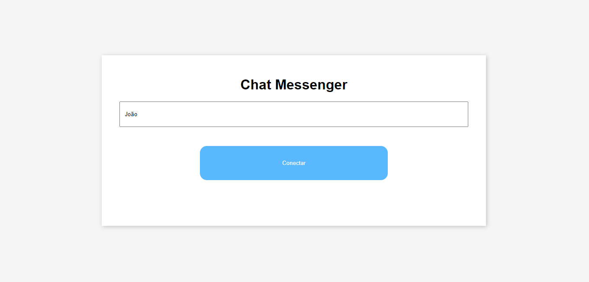
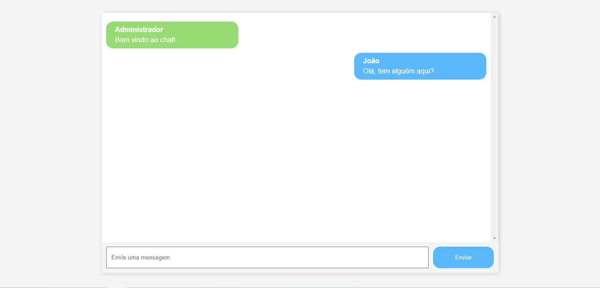

# Chat Messenger

A aplicação de bate-papo é uma plataforma que permite a conexão de um ou mais usuários para conversar em tempo real. Foi desenvolvida com o objetivo de aprimorar os 
conceitos aprendidos de WebSockets, uma tecnologia que permite a comunicação bidirecional em tempo real entre um cliente e um servidor. A aplicação foi projetada 
com foco no desenvolvimento do backend, proporcionando uma experiência de aprendizado prática na construção de soluções escaláveis e eficientes para aplicativos que 
requerem comunicação em tempo real. Além disso, a aplicação pode ser facilmente adaptada para suportar recursos adicionais, como autenticação de usuários, envio de 
arquivos e notificações, tornando-a uma base sólida para o desenvolvimento de aplicativos de bate-papo mais complexos.





## Rodando o projeto

Clone o repositório
```shell
git clone git@github.com:DicousDev/ChatMessenger.git
```

Com o Docker instalado e aberto, na pasta raiz do projeto, execute
```shell
docker-compose up -d
```
Com este comando, deve subir os container de back e front<br/>
A aplicação deve ficar disponível em http://localhost:5173

## Desenvolvimento

O desenvolvimento do projeto teve como foco principal a construção do backend, seguindo a arquitetura hexagonal e padrões de DDD (Domain-Driven Design). Essas 
práticas de desenvolvimento têm como objetivo garantir que o código seja organizado, escalável e facilmente mantido ao longo do tempo além de facilitar desenvolvimento dos testes. 
Além disso, a aplicação foi desenvolvida com a criação e acesso de WebSockets.

## Tecnologias

- Spring Boot
- React.js
- Docker
